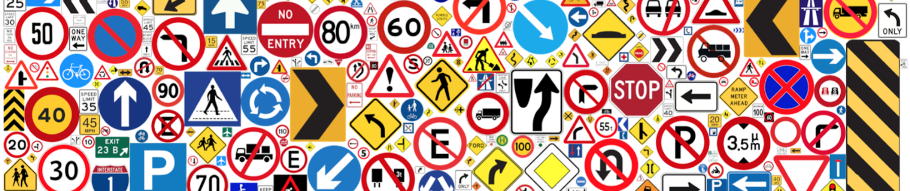
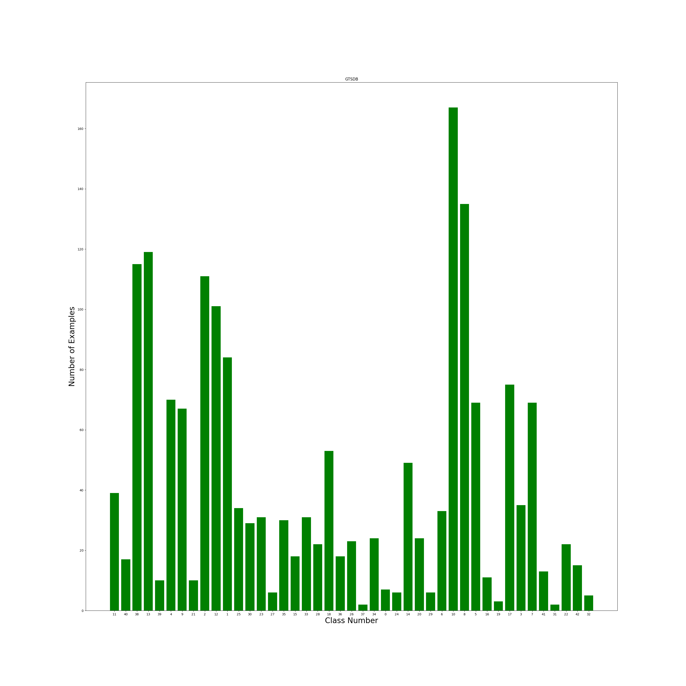

# Sign detection using dataset GTSDB

## Dataset German Traffic Sign Detection Benchmark



[GTSDB - German Traffic Sign Detection Benchmark - Kaggle](https://www.kaggle.com/datasets/safabouguezzi/german-traffic-sign-detection-benchmark-gtsdb)

## Dataset distribution

According to classes' distribution, the dataset is **not balanced**




## Define Custom Dataset class

We define custom dataset to handle the preprocessing of images with their bounding boxes and classes
```python
class myDataset(torch.utils.data.Dataset):
    def __init__(self, root, transforms=None):
        self.root = root
        self.transforms = transforms
        # load all image files, sorting them to ensure that they are aligned
        self.imgs = list(sorted(os.listdir(os.path.join(root, "imagesf"))))
 
    def __getitem__(self, idx):
        # Load image path
        img_path = os.path.join(self.root, "imagesf", self.imgs[idx])
        #Load image as PIL
        img = Image.open(img_path).convert("RGB")        
        # Get objects in the image
        objects = dic[self.imgs[idx]]
        # Get bounding box coordinates for each object in image
        boxes = []
        labels = []
        for obj in objects:
            #print(idx, obj[-1], self.imgs)
            name = obj[-1]
            labels.append(np.int(name))
            #Get bounding box coordinates
            xmin = np.float(obj[0])
            ymin = np.float(obj[1])
            xmax = np.float(obj[2])
            ymax = np.float(obj[3])
            boxes.append([xmin, ymin, xmax, ymax])

        boxes = torch.as_tensor(boxes, dtype=torch.float32)
        labels = torch.as_tensor(labels, dtype=torch.int64)        
 
        image_id = torch.tensor([idx])
        area = (boxes[:, 3] - boxes[:, 1]) * (boxes[:, 2] - boxes[:, 0])
        # suppose all instances are not crowd
        iscrowd = torch.zeros((len(objects),), dtype=torch.int64)
 
        target = {}
        target["boxes"] = boxes
        target["labels"] = labels
        target["image_id"] = image_id
        target["area"] = area
        target["iscrowd"] = iscrowd
 
        if self.transforms is not None:
            # Note that target (including bbox) is also transformed\enhanced here, which is different from transforms from torchvision import
            # Https://github.com/pytorch/vision/tree/master/references/detectionOfTransforms.pyThere are examples of target transformations when RandomHorizontalFlip
            img, target = self.transforms(img, target)
 
        return img, target
 
    def __len__(self):
        return len(self.imgs)
```


## Define the net

We used the model provided by the pytorch community
1. [Faster R-CNN model with a ResNet-50-FPN backbone from the Faster R-CNN](https://pytorch.org/vision/master/models/generated/torchvision.models.detection.fasterrcnn_resnet50_fpn.html#torchvision.models.detection.fasterrcnn_resnet50_fpn)
2. [Constructs an improved Faster R-CNN model with a ResNet-50-FPN backbone](https://pytorch.org/vision/master/models/generated/torchvision.models.detection.fasterrcnn_resnet50_fpn_v2.html#torchvision.models.detection.fasterrcnn_resnet50_fpn_v2)
3. [Constructs a high resolution Faster R-CNN model with a MobileNetV3-Large FPN backbone](https://pytorch.org/vision/master/models/generated/torchvision.models.detection.fasterrcnn_mobilenet_v3_large_fpn.html#torchvision.models.detection.fasterrcnn_mobilenet_v3_large_fpn)
4. [Low resolution Faster R-CNN model with a MobileNetV3-Large backbone tunned for mobile use cases](https://pytorch.org/vision/master/models/generated/torchvision.models.detection.fasterrcnn_mobilenet_v3_large_320_fpn.html#torchvision.models.detection.fasterrcnn_mobilenet_v3_large_320_fpn)
