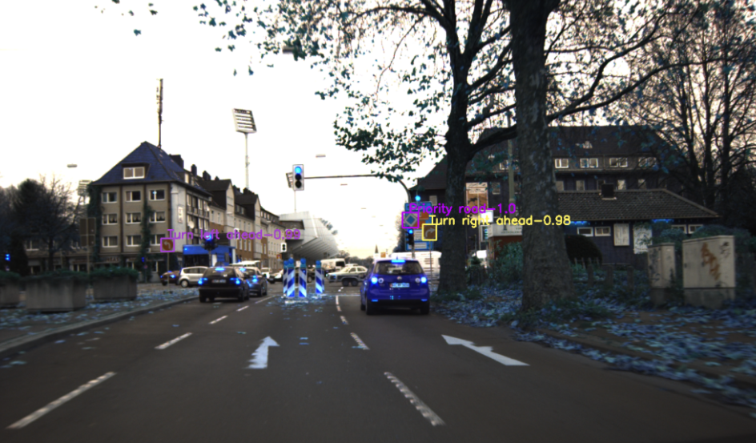
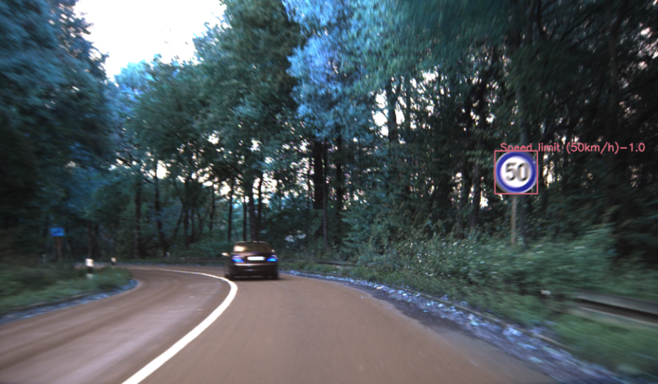

# Sign detection using dataset GTSDB

## Dataset German Traffic Sign Detection Benchmark


[GTSDB - German Traffic Sign Detection Benchmark - Kaggle](https://www.kaggle.com/datasets/safabouguezzi/german-traffic-sign-detection-benchmark-gtsdb)

## Dataset distribution

According to classes' distribution, the dataset is **not balanced**


## Define Custom Dataset class

We define custom dataset to handle the preprocessing of images with their bounding boxes and classes
```python
class myDataset(torch.utils.data.Dataset):
    def __init__(self, root, transforms=None):
        self.root = root
        self.transforms = transforms
        # load all image files, sorting them to ensure that they are aligned
        self.imgs = list(sorted(os.listdir(os.path.join(root, "imagesf"))))
 
    def __getitem__(self, idx):
        # Load image path
        img_path = os.path.join(self.root, "imagesf", self.imgs[idx])
        #Load image as PIL
        img = Image.open(img_path).convert("RGB")        
        # Get objects in the image
        objects = dic[self.imgs[idx]]
        # Get bounding box coordinates for each object in image
        boxes = []
        labels = []
        for obj in objects:
            #print(idx, obj[-1], self.imgs)
            name = obj[-1]
            labels.append(np.int(name))
            #Get bounding box coordinates
            xmin = np.float(obj[0])
            ymin = np.float(obj[1])
            xmax = np.float(obj[2])
            ymax = np.float(obj[3])
            boxes.append([xmin, ymin, xmax, ymax])

        boxes = torch.as_tensor(boxes, dtype=torch.float32)
        labels = torch.as_tensor(labels, dtype=torch.int64)        
 
        image_id = torch.tensor([idx])
        area = (boxes[:, 3] - boxes[:, 1]) * (boxes[:, 2] - boxes[:, 0])
        # suppose all instances are not crowd
        iscrowd = torch.zeros((len(objects),), dtype=torch.int64)
 
        target = {}
        target["boxes"] = boxes
        target["labels"] = labels
        target["image_id"] = image_id
        target["area"] = area
        target["iscrowd"] = iscrowd
 
        if self.transforms is not None:
            # Note that target (including bbox) is also transformed\enhanced here, which is different from transforms from torchvision import
            # Https://github.com/pytorch/vision/tree/master/references/detectionOfTransforms.pyThere are examples of target transformations when RandomHorizontalFlip
            img, target = self.transforms(img, target)
 
        return img, target
 
    def __len__(self):
        return len(self.imgs)
```


## Define the net

I used the model provided by the pytorch community
1. [Faster R-CNN model with a ResNet-50-FPN backbone from the Faster R-CNN](https://pytorch.org/vision/master/models/generated/torchvision.models.detection.fasterrcnn_resnet50_fpn.html#torchvision.models.detection.fasterrcnn_resnet50_fpn)
2. [Constructs an improved Faster R-CNN model with a ResNet-50-FPN backbone](https://pytorch.org/vision/master/models/generated/torchvision.models.detection.fasterrcnn_resnet50_fpn_v2.html#torchvision.models.detection.fasterrcnn_resnet50_fpn_v2)
3. [Constructs a high resolution Faster R-CNN model with a MobileNetV3-Large FPN backbone](https://pytorch.org/vision/master/models/generated/torchvision.models.detection.fasterrcnn_mobilenet_v3_large_fpn.html#torchvision.models.detection.fasterrcnn_mobilenet_v3_large_fpn)
4. [Low resolution Faster R-CNN model with a MobileNetV3-Large backbone tunned for mobile use cases](https://pytorch.org/vision/master/models/generated/torchvision.models.detection.fasterrcnn_mobilenet_v3_large_320_fpn.html#torchvision.models.detection.fasterrcnn_mobilenet_v3_large_320_fpn)

I used the 1 and 3 options


## Training

Main training loop
```python
for epoch in range(num_epochs):
    metrics = train_one_epoch(model, optimizer, data_loader, device, epoch, print_freq=50)
    losses.append(float(str(metrics.meters['loss']).split(" ")[0]))
    loss_box_reg.append(float(str(metrics.meters['loss_box_reg']).split(" ")[0]))
    loss_rpn_box_reg.append(float(str(metrics.meters['loss_rpn_box_reg']).split(" ")[0]))
    loss_classifier.append(float(str(metrics.meters['loss_classifier']).split(" ")[0]))
    loss_objectness.append(float(str(metrics.meters['loss_objectness']).split(" ")[0]))
    
    # Update the learning rate
    lr_scheduler.step()

    # Evaluate on the test dataset
    # _ gives coco_evaL obj from coco_eval.py from CocoEvaluator()
    _, metric_logger = evaluate(model, data_loader_test, device=device)
    stat = _.coco_eval['bbox'].stats
    
```


## Evaluation

```python
def showbbox(model, dataset):
    # The img entered is a tensor in the 0-1 range        
    plt.subplots_adjust(wspace=0, hspace=0)
    fig, axes = plt.subplots(10,sharex=True,sharey=True, figsize=(60, 60))
    model.eval()
    indexes = np.random.permutation(10)
    for i in range(10):
        img, _ = dataset[indexes[i]]
        with torch.no_grad():
            '''
            prediction Like:
            [{'boxes': tensor([[1221.7869,  523.7036, 1272.7373,  575.1018],
            [ 192.8189,  527.5751,  240.7135,  589.8405],
            [ 197.3745,  538.7914,  235.9153,  572.1550],
            [ 195.1216,  533.9565,  238.6585,  578.0548],
            [ 194.0861,  517.0943,  238.0777,  582.4178]], device='cuda:0'), 
            'labels': tensor([7, 7, 7, 8, 5], device='cuda:0'), 
            'scores': tensor([0.9792, 0.9036, 0.2619, 0.2407, 0.0575], device='cuda:0')}]
            '''
            prediction = model([img.to(device)])

        b = prediction[0]['boxes']
        #print(b)
        s = prediction[0]['scores']
        #print(s)

        #Apply Non-maximum suppression:
        keep = torchvision.ops.nms(b,s,0.1)
        #print(keep)

        img = img.permute(1,2,0)  # C,H,W_H,W,C, for drawing
        img = (img * 255).byte().data.cpu()  # * 255, float to 0-255
        img = np.array(img)  # tensor → ndarray
        #Convert np array img to right format.
        img = cv2.cvtColor(img, cv2.COLOR_BGR2RGB)
        #Class number coressponding to Classes
        classes = { 0:' Speed limit (20km/h)' ,
        1:' Speed limit (30km/h)' ,
        2:' Speed limit (50km/h)' ,
        3:' Speed limit (60km/h)' ,
        4:' Speed limit (70km/h)' ,
        5:' Speed limit (80km/h)' ,
        6:' End of speed limit (80km/h)' ,
        7:' Speed limit (100km/h)' ,
        8:' Speed limit (120km/h)' ,
        9:' No passing' ,
        10:' No passing veh over 3.5 tons' ,
        11:' Right-of-way at intersection' ,
        12:' Priority road' ,
        13:' Yield' ,
        14:' Stop' ,
        15:' No vehicles' ,
        16:' Veh > 3.5 tons prohibited' ,
        17:' No entry' ,
        18:' General caution' ,
        19:' Dangerous curve left' ,
        20:' Dangerous curve right' ,
        21:' Double curve' ,
        22:' Bumpy road' ,
        23:' Slippery road' ,
        24:' Road narrows on the right' ,
        25:' Road work' ,
        26:' Traffic signals' ,
        27:' Pedestrians' ,
        28:' Children crossing' ,
        29:' Bicycles crossing' ,
        30:' Beware of ice/snow' ,
        31:' Wild animals crossing' ,
        32:' End speed + passing limits' ,
        33:' Turn right ahead' ,
        34:' Turn left ahead' ,
        35:' Ahead only' ,
        36:' Go straight or right' ,
        37:' Go straight or left' ,
        38:' Keep right' ,
        39:' Keep left' ,
        40:' Roundabout mandatory' ,
        41:' End of no passing' ,
        42:' End no passing veh > 3.5 tons'  }


        for k in range(len(keep)):
            xmin = round(prediction[0]['boxes'][k][0].item())
            ymin = round(prediction[0]['boxes'][k][1].item())
            xmax = round(prediction[0]['boxes'][k][2].item())
            ymax = round(prediction[0]['boxes'][k][3].item())

            label = prediction[0]['labels'][k].item()

            #color = list(np.random.random(size=3)*256)
            colors = np.random.uniform(0, 255, size=(43, 3))

            if label in classes:
                pt1 = (xmin, ymin)
                pt2 = (xmax, ymax)
                score = prediction[0]['scores'][k].item()
                color = list(colors[label])
                cv2.rectangle(img, pt1, pt2, color, thickness=2)
                cv2.putText(img, classes[label]+"-"+str(round(score,2)), (xmin, ymin), cv2.FONT_HERSHEY_SIMPLEX, 0.7, color,
                            thickness=2)
        axes[i].imshow(img)
        axes[i].axis("off")
    fig.tight_layout()
    fig.show()
    

print("Function Loaded")
```

# Results
 
## Faster-RCNN Feature Pyramid Network Resnet-50 (200 epoch)





## Faster-RCNN Feature Pyramid Network Resnet-50 (1000 epoch)





## Training machine
```
Sat Nov 19 11:17:23 2022
+-----------------------------------------------------------------------------+
| NVIDIA-SMI 470.129.06   Driver Version: 470.129.06   CUDA Version: 11.4     |
|-------------------------------+----------------------+----------------------+
| GPU  Name        Persistence-M| Bus-Id        Disp.A | Volatile Uncorr. ECC |
| Fan  Temp  Perf  Pwr:Usage/Cap|         Memory-Usage | GPU-Util  Compute M. |
|                               |                      |               MIG M. |
|===============================+======================+======================|
|   0  NVIDIA RTX A5000    On   | 00000000:01:00.0 Off |                  Off |
| 51%   79C    P2   206W / 230W |   2851MiB / 24247MiB |     58%      Default |
|                               |                      |                  N/A |
+-------------------------------+----------------------+----------------------+
```
